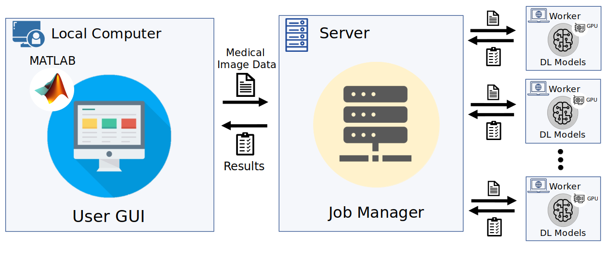
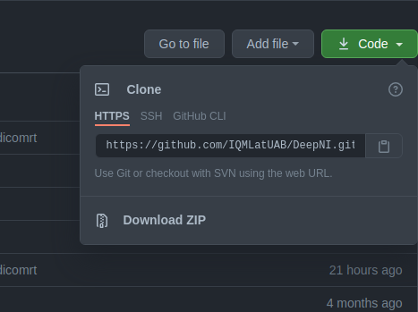
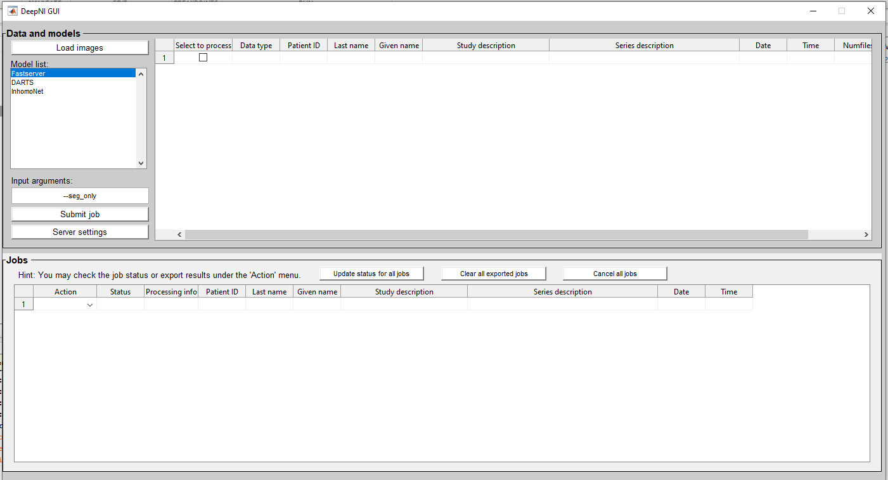
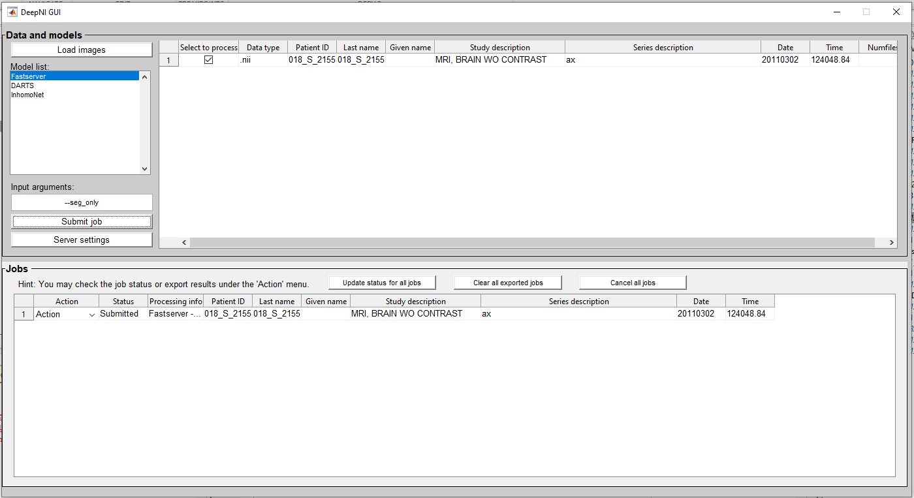
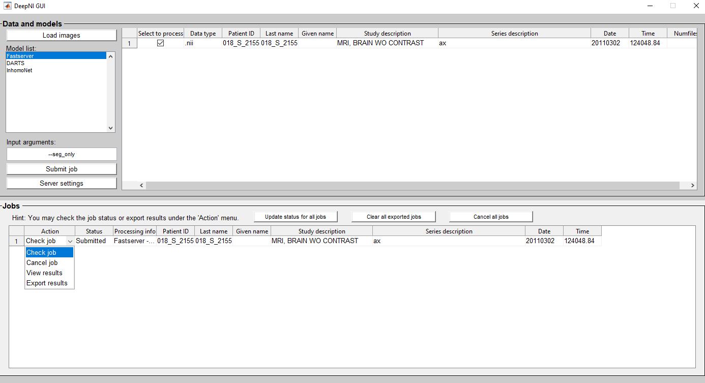
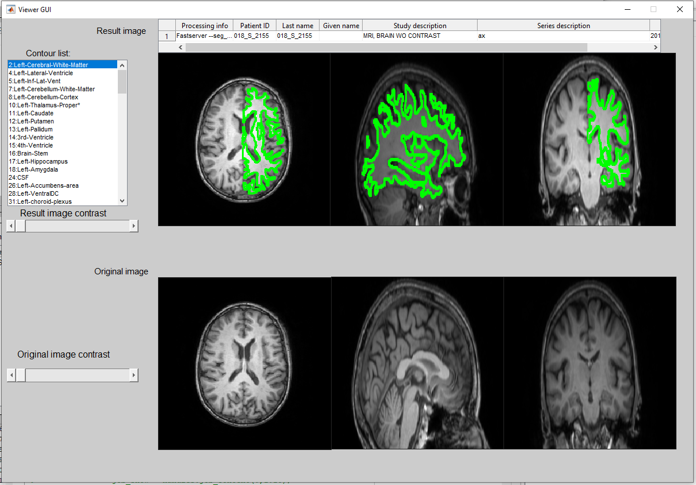

# DeepNI
[](https://github.com/IQMLatUAB/DeepNI)
[](https://)
[](https://github.com/IQMLatUAB/DeepNI)
[](https://github.com/IQMLatUAB/DeepNI)


DeepNI provides a remote computing server with GPUs for users to conduct medical image processing without the cumbersome of both software and hardware requirements on users' local computers.
DeepNI is **developed under Matlab 2020b**.
# Usage
## Contents
- [Download](#Download)
- [DeepNI_GUI](#DeepNI_GUI)
- [User_Instruction](#User_Instruction)
## Download

There are two ways that can download DeepNI on the local PC :
1. Dowload DeepNI repository .zip file, then unzip it to the local PC.



2. If the OS is Linux or MacOS, open the terminal, then type
```bash
$ cd YOUR_PREFERRED_INSTALLATION_PATH
$ git clone https://github.com/IQMLatUAB/DeepNI.git
```
After download is finished, Open MATLAB, change MATLAB current folder to the path that the user downloads this repo.
## DeepNI_GUI

- This is the User GUI of DeepNI.
- Run `DeepNI_GUI.m` under the `DeepNI` folder in matlab.
## User_Instruction

1. Click `Load images` button select the DICOM folder which needed to be processed.

2. Choose any `.dcm` file which belong to a specific DICOM series in the selection window. DeepNI will convert the DICOM file to NIfTI format.
    - `Notice: It is highly recommended to use a normal Axial-sliced T1 image with each size of dimension no smaller than 150 pixels if the user wish to perform classification work.`

3. Select the NIfTI image the user imported under the `Select to process` column and a desired model inside the `model list`. Then, specify the input arguments for the selected model the user wish to perform.

4. Click `Submit job` to transmit this job to the server for processing

    - Then, the image, input arguments (if any), and the selected model will be composed to a job, finally, the job will be moved to the lower `Jobs` panel with the `Status` becoming `Submitted`.
    

5. Click `Check job` under the action menu or `Update status for all jobs` button to refresh the job status and messages from the remote server, which shown in matlab command window. 
    - If the Job is finished, server will send the result back to the client, then `Status` column will change from `Submitted` to `Completed`.

6. After the Job is completed, the user can view the result by clicking the `View results` option under `Action` column.



7. The above image is a pop-up `Viewer GUI`. Ther are several functions we implemented.
    - User can choose which ROI they want to investigate by clicking the axial, sagittal, coronal sliced images.
    - User can click which classified label of contour they want to explore if performing the classification work.
    - User can also adjust the image contrast to investigate more detailed content inside the image.

8. If the user want to save the result, in `DeepNI_GUI`, click `Export results` under the `Action` column to save processing results in your local computer when the job `Status` is `Completed`. There will be a pop-up command window showing up and ask the user to save the result as NIfTI format or DICOM RTSS format.

> Make sure you export results before you close DeepNI because non-save results will be automatically eliminated. The name of export results is composed of the processing model name and the time that you export.
# Future Work
Right now, we are still working on implementing more DL models on the server so that the user can have more options to process the medical image.
# Maintainer
[@IQMLatUAB](https://github.com/IQMLatUAB)

[@Zi-Min Weng](https://github.com/elite7358)

[@Sheng-Chieh Chiu](https://github.com/chocolatetoast-chiu)
