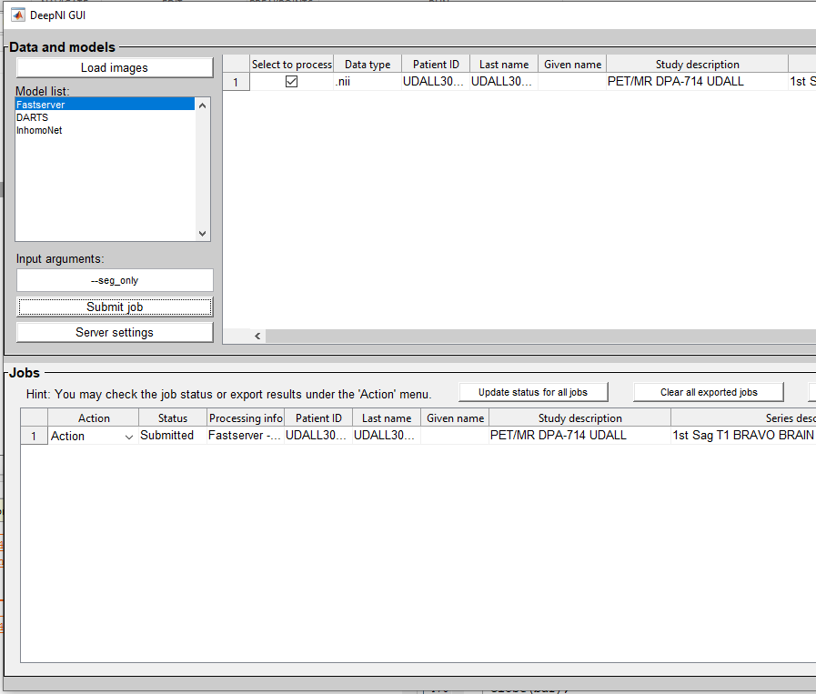

## DeepNI

DeepNI provides a remote computing server with GPUs for users to conduct medical image processing without the cumbersome of both software and hardware requirements.

## Installation

Dowload DeepNI repository and unzip it.

or try
    
    $ git clone https://github.com/IQMLatUAB/DeepNI.git
### Linux
    $ sudo apt-get install libzmq3-dev
    $ cd +jobmgr/+netsrv/private
    $ make
    
### Window

Launch matlab and run the `compile_for_windows.m` script in the `DeepNI/+jobmgr/+netsrv/private` directory.

## Instructions

1. Run DeepNI_GUI.m under the DeepNI folder in matlab.
2. Click "Load images" button to import medical images you want to process.
3. Select an image you import and a model in the model list. then click the "Submit job" button in order to transfer this job to the computing server to process.
4. Click "Check job" under the action menu or "Update status for all jobs" button to refresh the job status and messages from the remote server, which shown in matlab command window. 
5. Click "Export results" under the action menu to save processing results in your local computer when the job status is "Completed". Make sure you export results before you close DeepNI because non-save results will be automatically eliminated. 
